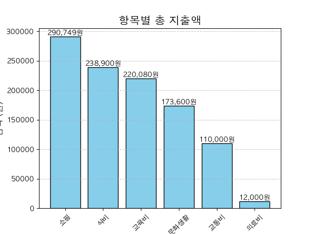
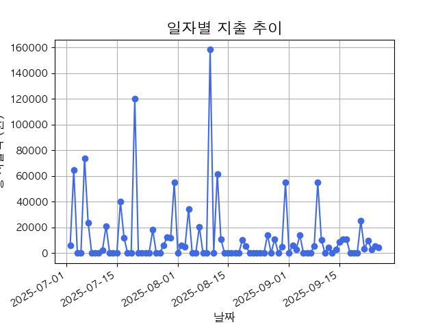

# budgetApp

## 프로젝트 한 줄 소개

개인 지출을 엑셀 파일로 만들어서 기록과 조회하고, 
이 데이터를 월별, 카테고리별 리포트와 그래프를 생성하는 Python 앱입니다.

### 1. 설치 / 실행 
   1. 버전 확인
      python -V # 3.10+ 권장
   2. 가상 환경 (선택)
      python -m venv .venv
      source .venv/bin/activate
   3. 의존성 설치
      pip install pandas matplotlib
   4. 실행
      python main.py

### 2. 프로젝트 구조
    budgetApp/
    ├─ main.py                 # 메뉴형 CLI 진입점
    ├─ budget.py               # 지출 추가/조회/삭제
    ├─ analysis.py             # 검색/리포트/시각화
    ├─ data_manage.py          # 파일 I/O(JSON/CSV/Excel)
    ├─ budget_manager.py       # 예산 설정/조회
    ├─ expense.json            # 내부 저장소(예시)
    ├─ data_samples/           # 데모용 샘플 데이터 
    │  ├─ 지출내역서_sample.xlsx
    │  └─ expenses_sample.csv
    ├─ plots/                  # 예시 그래프 
    │  ├─ expense_bar_chart.png
    │  └─ expense_line_chart.png
    └─ README.md

### 3. 주요 기능

- 지출 추가/ 조회/ 삭제
- 월별 예산 설정 및 지출 현황 확인
- csv 파일로 내보내기
- 월별/ 카테고리별 집계
- 막대/ 선 그래프로 저장
  
### 4. 명령 흐름 예시 
====== My BudgetApp ======
1. 지출 추가
2. 지출 내역 보기
3. 지출 내역 삭제
--------------------------
4. 지출 내역 검색하기
5. 월별 리포트 보기
--------------------------
6. 예산 설정하기
7. 예산 대비 지출 현황 보기
--------------------------
8. CSV 파일로 내보내기
9. 지출 내역 시각화하기
10. 프로그램 종료

#### 1) 지출 추가 예시
- 날짜 (YYYY-MM-DD): 2025-09-29
- 내역: 투썸
- 금액: 4500
- 항목: 식비
- => 저장되었습니다.

#### 2) 내역 보기
2025-09-29 | 투썸 |   4,500 | 식비

#### 3) CSV 내보내기 -> 시각화 연동
1. (8) CSV 파일로 내보내기 -> exports/expenses.csv 생성
<<<<<<< HEAD
2. (9) 지출 내역 시각화하기 -> plots/expense_bar_char.png, plots/expense_line_chart.png생성
=======
2. (9) 지출 내역 시각화하기 -> plots/expense_bar_chart.png, plots/expense_line_chart.png생성
>>>>>>> 43d96c6 (reinit local repo)

예시 이미지:
1. 카테고리 막대그래프
   

2. 지출 일자별 선그래프
   

### 5. 데이터 스키마
- 공통 키: date/날짜, item/내역, amount/금액, category/항목
- 형식
- - date/날짜: YYYY-MM-DD
- - amount/금액: 정수(원)
- - item: 문자열
- - category: {"식비","교통비","쇼핑","문화생활","교육비","의료비",...}

- 데이터 source 선택
- - 기본 data source는 main.py상단의 DATA_Ex로 지정함
- - expense.json (내부저장) 혹은 지출내역서.xlsx(엑셀) 중 선택
<<<<<<< HEAD
- - exports/expenses.csvsms (8) 내보내기 실행 시 생성
=======
- - exports/expenses.csv (8) 내보내기 실행 시 생성
>>>>>>> 43d96c6 (reinit local repo)

### 6. .gitignore
    # User-generated data (원본 무시)
    expense.json
    expenses.csv
    지출내역서.xlsx

    # allow samplesd
    !data_samples/
    !data_samples/*.xlsx
    !data_samples/*.csv

    # (선택) plots 생성물 대부분 무시, 데모 2장만 추적
    # plots/*
    # !plots/expense_bar_chart.png
    # !plots/expense_line_chart.png
  - 실제 데이터는 리포지토리에 포함하지 않고, 데모용 샘플만 포함합니다.

